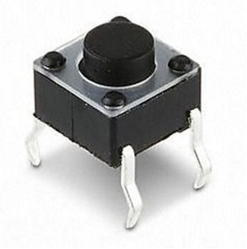
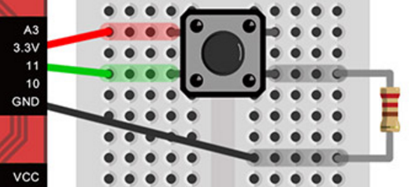

Title: Button
Date: 2017-05-06 21:01
Category: Arduino
Tags: notes, Arduino
Slug: Arduino-Button-part
Author: 40423222

以下為Button的解說

<!-- PELICAN_END_SUMMARY -->

### 按鈕零件: 
 

### 按鈕功用: 
1和2為接通狀態,3和4為接通狀態,但1和2跟3和4沒接通 
只有在按下按鈕時1和2跟3和4才會接通 
電路圖(Circuit diagram) 
 

### Button裝備方式:
3.3V連接在B1,在不按下按鈕時,3.3V不會通道B3和B4,只會跟B2接通 
11腳位為接收訊號,在不按下時訊號為LOW,在按下時訊號為HIGH 
在B4接上電阻跟地線(GND),可保護11腳位不被雜訊干擾 
 

### Arduino範例: 
 
<a href="https://40423222.github.io/2017springcd_hw/blog/Arduino-Button.html">https://40423222.github.io/2017springcd_hw/blog/Arduino-Button.html</a>

### 參考網站: 
1.按鈕零件:
<a href="https://tw.bid.yahoo.com/item/6-6-5MM%E5%BE%AE%E5%8B%95%E9%96%8B%E9%97%9C-%E8%BC%95%E8%A7%B8%E9%96%8B%E9%97%9C-%E6%8C%89%E9%8D%B5%E9%96%8B%E9%97%9C-%E8%87%A5%E5%BC%8F-%E9%8A%85%E8%85%B3-200%E5%80%8B%E4%B8%80-100035665893">https://tw.bid.yahoo.com/item/6-6-5MM%E5%BE%AE%E5%8B%95%E9%96%8B%E9%97%9C-%E8%BC%95%E8%A7%B8%E9%96%8B%E9%97%9C-%E6%8C%89%E9%8D%B5%E9%96%8B%E9%97%9C-%E8%87%A5%E5%BC%8F-%E9%8A%85%E8%85%B3-200%E5%80%8B%E4%B8%80-100035665893</a> 
參考對象:
 

2.按鈕功用:
<a href="https://tw.bid.yahoo.com/item/6-6-5MM%E5%BE%AE%E5%8B%95%E9%96%8B%E9%97%9C-%E8%BC%95%E8%A7%B8%E9%96%8B%E9%97%9C-%E6%8C%89%E9%8D%B5%E9%96%8B%E9%97%9C-%E8%87%A5%E5%BC%8F-%E9%8A%85%E8%85%B3-200%E5%80%8B%E4%B8%80-100035665893">https://tw.bid.yahoo.com/item/6-6-5MM%E5%BE%AE%E5%8B%95%E9%96%8B%E9%97%9C-%E8%BC%95%E8%A7%B8%E9%96%8B%E9%97%9C-%E6%8C%89%E9%8D%B5%E9%96%8B%E9%97%9C-%E8%87%A5%E5%BC%8F-%E9%8A%85%E8%85%B3-200%E5%80%8B%E4%B8%80-100035665893</a> 
參考對象:
 

3.button裝備方式:
<a href="https://webduino.io/tutorials/tutorial-09-button-led.html">https://webduino.io/tutorials/tutorial-09-button-led.html</a> 
參考對象:
 

4.Arduino範例:
<a href="https://40423222.github.io/2017springcd_hw/blog/">https://40423222.github.io/2017springcd_hw/blog/</a> 
參考對象:
 