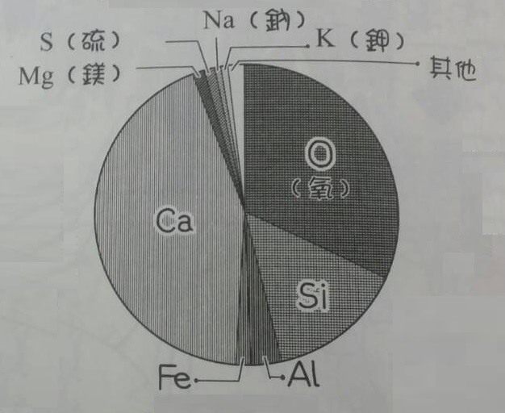

Title: Concrete
Date: 2017-06-17 10:14
Category: Concrete
Tags: notes, Concrete
Slug: Concrete
Author: 40423222

Concrete的介紹

<!-- PELICAN_END_SUMMARY -->

## 參考對象
<pre>
書: 世界第一簡單 混凝土 世茂出版集團
本書以漫畫方式表示
</pre>

## 前言
<pre>
混凝土是常見的建築材料,也可稱為水泥(cement),但<u>水泥並非混凝土</u>
而因為混凝土是低技術性的建築材料代表,在日常生活中很常見,大多數人反而不在意混凝土,不了解混凝土
在千年前就有混凝土,至今人們還在開發各種新技術,使混凝土更多<u>用途/功能</u>
混凝土主要研究分兩種,<b>(混凝土材料)</b>和<b>(混凝土結構)</b>,這本書討論混凝土材料
</pre>

## 本介紹適合以下讀者:
<pre>
想要了解混凝土的人
喜歡建築房屋
不了解混凝土,但有興趣的人
</pre>

## 混凝土是什麼?
<pre>
<h3><b>製造的材料</b></h3>
混凝土由骨材(砂 礫石)跟漿體(水泥 水 空氣)組成

骨材是混凝土的基礎,決定結構是否堅固,所以才叫做[骨]材
而漿體是漿骨材結合,漿體用的水為pH=12~13的強鹼

<h3><b>製成</b></h3>
建在施工現場附近,製造混凝土的工廠,稱為配料廠(batch plant),具有儲存材料的水泥儲槽(cement silo),計量材料的設備,以及混合材料
的攪拌機
建造混凝土重力霸(concrete gravity dam)等需要大量混凝土的結構物,會在施工現場附近設置配料場,以減少運費,提升經濟效益
日本剛開始使用混凝土,大多在現場製作混凝土
但在1955年後,發明了混凝土拌合車(agitator),因此,日本開始廣泛使用預拌混凝土
即便施工現場沒有配料場,也能訂購[預拌混凝土],在近代此方法還是非常普遍
預製品是預鑄混凝土工廠製造的預鑄混凝土構件
潛盾隧道(shield tunnel)所用的隧道環片(tunnel segment)/預鑄樓板/箱涵(box culvert)/擋土牆/
電線桿,都是混凝土預製品
混凝土預製品在工廠製作,優點是易於管理施工流程,品質穩定
水泥加水後時間越久,混凝土會漸漸變硬
<b>新伴混凝土(fresh concrete):</b>剛製成的混凝土,為軟質狀態
<b>預拌混凝土(ready mixed concrete):</b>而在工廠拌好再送到施工現場的混凝土
<b>預鑄混凝土:</b>在工廠鑄造好混凝土預製品,再送到施工現場

<h3><b>材料比例</b></h3>
混凝土成分比例,在日本,土木界稱為:配合,建築界稱為:調和
設計正確的比例,才能具有強度和耐久性,這稱為:配比設計

水泥比例增加可以加強混凝土強度跟耐久性,但硬度太高會不易<u>加工/澆置</u>
此外,混凝土對周圍的濕度和溫度的變化很敏感
</pre>

## 關於骨材?
<pre>
骨材分為,0.15~5mm的砂(細骨材),5mm以上的礫石(粗骨材)
骨材有,天然骨材和人工骨材和再生骨材
<b>天然骨材: </b>採用自然的材料
例如: 河砂/河川礫石,山砂/山礫石,陸砂/陸礫石,海砂.........
<b>人工骨材:</b> 由於環保問題,越難使用到天然骨材,於是使用石頭,加工成人工骨材
例如: 碎砂/碎石
<b>再生骨材: </b>從廢棄的混凝土中取出骨材
</pre>

## 關於水泥?
<pre>
<h3><b>凝固</b></h3>
水泥跟水接觸產生[水合反應],才產生固化(凝固)

<h3><b>正式名稱</b></h3>
水泥正式名稱: 波特蘭水泥(Portland Cement)

<h3><b>成分</b></h3>
<b>水泥</b>

跟地殼的成分很相近
<b>地殼</b>

所以水泥的原料,不難取得,可以<b>大量製造</b>
混凝土成本低(1公升不到台幣3元)
</pre>

## 水泥的製造
<pre>
將原料(石灰石 矽石 黏土)磨成粉,投入1450度的融爐.成為燒結物[熔塊](clinker),經由冷卻裝置將熔塊急速冷卻,並和石膏混合,在粉碎,最後成為水泥

水泥原料也可以使用,火力發電排出的[飛灰],或是造鋼鐵的[高爐渣]
在日本還會使用垃圾焚化的灰燼,來製作[環保水泥]
</pre>

## 刻印時間的混凝土
<pre>
混合材料的混凝土會變成柔軟的可塑狀態,可填入各種模板,製成不同形狀
尚為硬化的混凝土稱為[新拌混凝土](fresh concrete),將混凝土填入模板,這動作稱為[澆置],燒製後數小時,水泥會和水產生化學反應(水合反應),漸漸硬化
一般的混凝土,四週便會完成70~80%的水合反應
混凝土完成澆置的一個月內,硬化情形會影響混凝土的性質
讓混凝土順利硬化的[養護]步驟,決定混凝土的耐久性
注意: 將配好的材料混合並澆置之外,還要照顧(養護)
從軟的新拌混凝土,到形成骨架,發揮材料硬度,經由長年的時間,漸漸會出現損傷,
性質和性能都會改變,所以混凝土具有保留歲月痕跡的特徵,[混泥土是(活)材料]

</pre>

## 混凝土的配比
<pre>
配比的表示法[1m^3有多少質量],稱為單位量(如下表)
<table border="5" width="100%" align="center">
<tr>
<td style="text-align:center" rowspan="2" bgcolor='#FFD78C'>水灰比(質量%)</td>
<td style="text-align:center" rowspan="2" bgcolor='#FFD78C'>空氣量(%)</td>
<td style="text-align:center" colspan="4" bgcolor='#FFD78C'>單位量(kg/m3)</td>
<tr>
<td style="text-align:center">水</td>
<td style="text-align:center">水泥</td>
<td style="text-align:center">細骨材</td>
<td style="text-align:center">粗骨材</td>
<tr>
<td style="text-align:center">52.1</td>
<td style="text-align:center">4.0</td>
<td style="text-align:center">150</td>
<td style="text-align:center">288</td>
<td style="text-align:center">832</td>
<td style="text-align:center">1040</td>
</table>
水和水泥的用量,決定混凝土的性質與價格
水的單位量稱為[單位水量],水泥的單位量稱為[單位水泥量]

水和水泥混合成水泥漿體(cement paste),加入細骨材製成砂漿(mortar),
在加入粗骨材即成為混凝土
上表中的水灰比是水與水泥構成水泥漿體的比例,與強度跟耐久性有直接關聯,
是重要的數值
例如: 水灰比越低,水泥漿體的水泥濃度就越高,混凝土的強度和耐久性越大
空氣量是混凝土內含有的空氣比例,混凝土內的空氣直徑為10~200um(micrometer lum=0.2mm)的獨立氣泡
用[AE減水劑]的混合藥劑,可控制混凝土的氣泡含量
獨立氣泡能提高混凝土的耐久性(尤其是寒害的抵受性),但空氣太多強度會下降,一般控制在4~7%
</pre>

## 混凝土的優缺點
<pre>
優點:
廉價
可自由塑型
具有耐久性和耐火性
缺點:
很重
難以拆除
多有裂縫
結構的性能容易受施工品質影響(尤其是耐久性)

優缺點示一體兩面的,例如: 混凝土重力壩,就是利用很重這點來抗水壓,將缺點轉優點
混凝土的密度(比重),會因為配比跟原料而改變,混凝土1m^3約為2.3t
混凝土的重量,主要來置於骨材(砂 礫石)的密度
</pre>

## 混凝土的力學特徵
<pre>
一般使用20~40(MPa)的混凝土,但在近年,200(MPa)的高強度混凝土漸漸實用
200(MPa)是指1cm^2可承受2t的負重,這種混凝土用於高樓的鋼筋混凝土結構
高樓建築物重量大,為了承受重量將柱子加粗,但這樣會減少居住空間
因此高強度混凝土被廣泛使用

混凝土對於壓(MPa)的耐性強,但對於抗拉就只有1/10的抗壓強度
所以將抗拉的[鋼將]跟抗壓的[混凝土]結合,成為鋼筋混凝土(Reinforced Concrete 一般稱為RC)
</pre>

## 何時開始使用混凝土
<pre>
9000年前,於現在以色列蓋瑞亞(Galleria)南部,稱為Iftah的混凝土
5000年前,中國西安,大地灣混凝土

古羅馬人正式開始用混凝土為建築材料,根據[羅馬人的物語],新潮社出版
龐貝城遺址的混凝土,經由1000年以上的歷史,仍完好如初

日本是木製建築物
但在明治時期引進波特蘭水泥技術,才開始了土木工程
經由廣井勇博士的[砂漿試錠]實驗,完成了日本第一座混凝土大型防波堤,並證實可耐用於海洋環境

目前有利用混凝土的耐久性來處理放射性廢棄物,但還在實驗階段,需要證實混凝土能耐久到萬年
</pre>

## 新拌混凝土的性質
<pre>
新拌混凝土在剛混合時,呈現柔軟狀態,但時間太長的話會變硬,必須迅速送到現場
日本混凝土標準規定,25度時混合後到澆置的時間為兩小時以內,25度以上為一個半小時
送到現場前要先做坍度試驗,將混凝土放入[坍度錐],來製作出混凝土錐山

坍度大代表柔軟和流動性好,坍度小代表堅硬和流動性差
土木結構物一般使用坍度小的混凝土,因為和建築物相比使用的斷面較大,
而且建築物的鋼筋和管配設備較多,所以建築物需要坍度較大的混凝土

但近年來土木結構物為了增強耐震能力,而添加許多鋼筋,使用的坍度比以前更大

在將混凝土澆置入模板後,就需要用[震動器],排除多於空氣並分散物質
但這樣會造成混凝土內部重的物質(骨材)沉澱/輕的物質上升,稱為[材料分離]
因而強度跟耐久性下降
但提高水泥量可預防材料分離,因為提高水泥量混凝土黏度增強,骨材就很難下沉
只是這樣流動性為下降,澆置作業會變困難,而有了[高性能AE簡水劑]後,
即便水分少的混凝吐也能有流動性
因此誕生了解決[材料分離]跟[流動性差]的[自填混凝土],不需要震動擠壓就能填滿模板
</pre>

## 澆置
<pre>
每次澆置40~50cm就要暫置一段時間,等他硬化在繼續澆置,因此為有[冷縫]的不連續斷面,
所以日本有標準規定[容許澆置的間隔時間],外界溫度25以下兩個小時半,25度以上是兩個小時

</pre>

## 壓實
<pre>
讓混凝土填滿整個模板稱為壓實,如果壓實不徹底會產生[石窩]的缺陷

</pre>

## 混凝土重力壩
<pre>
混凝土重力壩的技術有許多是在日本獨自開發,其中有RCD(Roller Compacted Dam)工法,
可降低成本,縮短工期
</pre>

## 水合反應的運作
<pre>
混凝土會硬化是因為水合反應,水根水泥接觸就會有水合反應,只要是矽酸鈣跟水反應,
產生了[C-S-H膠體]的水合物

混凝土不會馬上硬化,因為水合反應不是馬上發生,需要一段時間鈣才會從水泥熔出,稱為[誘導期]
水泥的組成會引響反應時間,而這些化學物質稱為[礦物組成],
矽酸三鈣(C3S)/矽酸二鈣(C2S)/鋁酸三鈣(C3A)/鋁鐵酸四鈣(C4FA)(數字是在文字下方),
矽酸三鈣跟矽酸二鈣佔水泥成分70~80%,含量較多的矽酸三鈣水泥較快硬化,
因為矽酸三鈣反應比矽酸二鈣快
</pre>

## 養護
<pre>
為了確實進行水合反應,所以不能讓水溢出混凝土
讓澆置的混凝土確實水合反應,這作業稱為[養護]

用帆布蓋在澆置的混凝土上,就是避免混凝土乾燥
也有的會灑水或包上保鮮膜,來防止乾燥
養護關西到強度,非常重要
</pre>

## 混凝土的成長
<pre>
混凝土在水合反應後,會產生水合物無法填滿的空間,成為[毛細管孔隙],以微米(um)為單位,
跟C-S-H膠體產生的[膠體空間],以奈米(nm)為單位
而毛細管孔隙越多,骨材結合越鬆弛,混凝土硬度下降
提高水泥漿體的水泥濃度,能減少水泥粒子間的距離,減少毛細管孔隙

在水合反應的過程中,可能會有裂縫,稱為[初期缺陷],而主要分為兩種裂縫,[熱裂縫]跟[乾燥收縮裂縫]

熱烈縫,在水合反應時會產生熱,1g的水泥(矽酸三鈣)會放出120卡(cal)的熱量(504焦耳(J)),
1g的水上升1度需要的熱量為1卡(cal),所以材料內部會上升60~80度,
所以混凝土外冷內熱,外側收縮,內側膨脹,因而產生熱裂縫(混凝土不抗拉)
為了抵制熱裂縫,可使用水合熱較少的[低熱波特蘭水泥],或用冷卻材料來[預冷],
或是傳輸冷水的管子穿過結構內部來冷卻[管冷]

乾燥收縮裂縫,因為外部乾燥收縮,但內部幾乎不變,所以使表面的拉力造成裂縫,如同乾旱龜裂的土地

如何減輕裂縫
在混凝土上灑水等養護動作,可防止初期缺陷,也可使用[收減低劑]跟[膨脹才]來制止混凝土收縮
運用鋼筋來減少裂縫

</pre>

## 混凝土結構的劣化
<pre>
鋼筋因為漿體(水和水泥 pH=12~13),而產生[鈍態膜]的極密氧化膜,來保護鋼筋
劣化分為兩種,鋼筋生鏽或混凝土劣化

鋼筋生鏽
因為鋼筋的鈍態膜被破壞,所以生鏽,主要原因被鹵素離子攻擊跟混凝土失去鹼性,
鹵素就是鹽的氯離子,氯離子會滲入混凝土,接觸到鋼筋,破壞鈍態膜,造成生鏽,
而大氣中的二氧化碳會讓混凝土失去鹼性,二氧化碳跟水結合成為碳酸,在跟混凝土的氫氧化鈣反應,
形成碳酸鈣,失去鹼性,稱為混凝土的[中性化],因為氯離子跟中性化,鋼筋會產生電流,例如:伏打電池,
電化反應造成鋼筋氧化,生鏽的鋼筋滲出氧化鐵,體積因而膨脹,因此造成混凝土龜裂

防止鋼筋生鏽
給混凝土上一層[保護層],防止氯離子跟碳酸進入,但如果氯離子已經進入到鋼筋,這時可用[電氣防蝕],
產生跟腐蝕鋼筋電流相反方向的電流,來阻止腐蝕

混凝土劣化
其中一種為[鹼-氧化矽反應(鹼性骨材反應)],水泥的鹼性跟某種骨材反應造成膨脹,使混凝土龜裂
溫度變化也會劣化混凝土,由[凍結溶解作用],混凝土內部的水反覆結凍解凍,使內部膨脹收縮,因而劣化

防止混凝土劣化
一旦產生鹼-氧化矽反應就很難阻止劣化(減少跟水接觸能緩和劣化速度),所以選擇反應小的骨材很重要
將空氣泡混入混凝土,來降低水結凍,解決凍結溶解作用
</pre>

## 混凝土之不同種類
<pre>
用於高樓的[高強度混凝土]
用於變形的[超高強度纖維補強混凝土(UFC)]
適用於海中澆置的[水中不分離性混凝土]
有助於環境的[多孔混凝土]
善於隔熱的[高壓蒸汽輕質混凝土]
有自我復的[裂縫自我修復混凝土]
</pre>

心得:
我會讀這本混凝土的書,是因為他是以漫畫來呈現