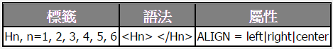
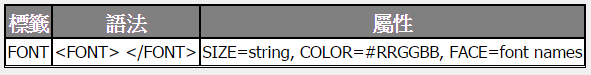

Title: HTML-texts
Date: 2017-05-17 03:09
Category: HTML
Tags: notes, w8
Slug: HTML-texts
Author: 40423222

以下為HTML的texts說明

<!-- PELICAN_END_SUMMARY -->

# 關於texts指令說明

### 表格說明:
<table align=center border=1 cellspacing=0 style="border:1px solid black" bgcolor=white>
<tr><th class=boldw>標籤<th class=boldw>說明及範例
<tr><td>&lt;B&gt;<td>將所標記的文字<b>字型加粗
<tr><td>&lt;I&gt;<td>將所標記的文字<i>變成斜體
<tr><td>&lt;U&gt;<td>將所標記的文字<u>加上底線</u>
<tr><td>&lt;STRIKE&gt;<td>將所標記的文字<strike>畫線刪除</strike>
<tr><td>&lt;BIG&gt;<td>將所標記的文字<big>放大</big>
<tr><td>&lt;SMALL&gt;<td>將所標記的文字<small>縮小</small>
<tr><td>&lt;SUP&gt;<td>將所標記的文字變成上標
<tr><td>&lt;SUB&gt;<td>將所標記的文字變成下標
<tr><td>&lt;EM&gt;<td>將所標記的文字<em>加以強調</em>
<tr><td>&lt;STRONG&gt;<td>將所標記的文字<strong>加重語氣</strong>
<tr><td>&lt;TT&gt;<td>將所標記的文字以 <tt> Teletype font </tt>字型表現，常用在固定大小的文字上
<tr><td>&lt;CODE&gt;<td>將所標記的文字以 <code> Code Fragment </tt>字型表現，常用在程式碼的敘述上
<tr><td>&lt;VAR&gt;<td>將所標記的文字以 <var> Variable </var>字型表現，常用在算數式的變數上
</table>

### 表格指令:
<pre class="brush: python">
<table align=center border=1 cellspacing=0 style="border:1px solid black" bgcolor=white>
<tr><th class=boldw>標籤<th class=boldw>說明及範例
<tr><td>&lt;B&gt;<td>將所標記的文字<b>字型加粗
<tr><td>&lt;I&gt;<td>將所標記的文字<i>變成斜體
<tr><td>&lt;U&gt;<td>將所標記的文字<u>加上底線</u>
<tr><td>&lt;STRIKE&gt;<td>將所標記的文字<strike>畫線刪除</strike>
<tr><td>&lt;BIG&gt;<td>將所標記的文字<big>放大</big>
<tr><td>&lt;SMALL&gt;<td>將所標記的文字<small>縮小</small>
<tr><td>&lt;SUP&gt;<td>將所標記的文字變成上標
<tr><td>&lt;SUB&gt;<td>將所標記的文字變成下標
<tr><td>&lt;EM&gt;<td>將所標記的文字<em>加以強調</em>
<tr><td>&lt;STRONG&gt;<td>將所標記的文字<strong>加重語氣</strong>
<tr><td>&lt;TT&gt;<td>將所標記的文字以 <tt> Teletype font </tt>字型表現，常用在固定大小的文字上
<tr><td>&lt;CODE&gt;<td>將所標記的文字以 <code> Code Fragment </tt>字型表現，常用在程式碼的敘述上
<tr><td>&lt;VAR&gt;<td>將所標記的文字以 <var> Variable </var>字型表現，常用在算數式的變數上
</table>
</pre>

## 換行指令

### 列如:
<html>
<body>
利用&lt;br&gt;來切換 到下一行

新的一個段落，會和前面的文字隔開一列
換行並加上水平線
<blockquote>文字會自成一個段落，並以縮排的方式表現出來，而且與上下文章保留一段空白</blockquote>
靠右視窗寬度50%無陰影粗10:

以上為換行指令範例
</body>
</html>

### 指令:
<pre class="brush: python">
<html>
<body>
利用＆lt;br＆gt;來切換 到下一行

新的一個段落，會和前面的文字隔開一列
換行並加上水平線
<blockquote>文字會自成一個段落，並以縮排的方式表現出來，而且與上下文章保留一段空白</blockquote>
靠右視窗寬度50%無陰影粗10:

以上為換行指令範例
</body>
</html>
</pre>
為了不讓「小於」及「大於」符號被瀏覽器解譯，因此要寫成「＆lt;」和「＆gt;」。相關的對照表，會在後續章節說明。

## 字體大小和位置

### 列如:
<h1 align="left">H1在左邊</h1>

<h6 align="right">H6在右邊</h6>

<h3 align="center">範圍:H1到H6,H1為最大,H6為最小</h3>

字體大小為1

字體大小為7

可輸入比7大的值,但最大的顯示只會到7

可輸入負數來縮小字體大小

FACE="Symbol" 你便可以顯示羅馬字母 a, b, c, d

用 FACE="標楷體" 來顯示 中文標楷體

字的顏色

### 指令:
<pre class="brush: python">
<h1 align="left">H1在左邊</h1>

<h6 align="right">H6在右邊</h6>

<h3 align="center">範圍:H1到H6,H1為最大,H6為最小</h3>

字體大小為1

字體大小為7

可輸入比7大的值,但最大的顯示只會到7

可輸入負數來縮小字體大小

FACE="Symbol" 你便可以顯示羅馬字母 a, b, c, d

用 FACE="標楷體" 來顯示 中文標楷體

字的顏色
</pre>

## 數學公式

### 列如:
一個 d 維的高斯機率密度函數（Gaussian probability density function）可以表示成：

g(x, m, S) = 
(2p)-d/2 *
det(S)-0.5 *
exp[-(x-m)TS-1(x-m)/2]

其中 m 是此高斯機率密度函數的平均向量（Mean vector），
S 則是其共變異矩陣（Covariance matrix）

### 指令:
<pre class="brush: python">
一個 d 維的高斯機率密度函數（Gaussian probability density function）可以表示成：

g(x, m, S) = 
(2p)-d/2 *
det(S)-0.5 *
exp[-(x-m)TS-1(x-m)/2]

其中 m 是此高斯機率密度函數的平均向量（Mean vector），
S 則是其共變異矩陣（Covariance matrix）
</pre>

## 跑馬燈

### 列如:
<marquee direction=left  bgcolor="#ff9999" behavior=scroll    scrollamount=10 scrolldelay=100>嗨！我是一號跑馬燈</marquee> 
<marquee direction=right bgcolor="#99ff99" behavior=slide     scrollamount=20 scrolldelay=100>Hello！我是二號跑馬燈</marquee> 
<marquee direction=left  bgcolor="#9999ff" behavior=alternate scrollamount=30 scrolldelay=100>嘿嘿！我是三號跑馬燈</marquee> 

### 指令:
<pre class="brush: python">
<marquee direction=left  bgcolor="#ff9999" behavior=scroll    scrollamount=10 scrolldelay=100>嗨！我是一號跑馬燈</marquee> 
<marquee direction=right bgcolor="#99ff99" behavior=slide     scrollamount=20 scrolldelay=100>Hello！我是二號跑馬燈</marquee> 
<marquee direction=left  bgcolor="#9999ff" behavior=alternate scrollamount=30 scrolldelay=100>嘿嘿！我是三號跑馬燈</marquee> 
</pre>

### 表格說明:
<table align=center border=1 cellspacing=0 style="border:1px solid black" bgcolor=white>
<tr><td class=boldw>標籤<td colspan=2>marquee
<tr><td class=boldw>功能<td colspan=2>移動字體
<tr><td class=boldw>語法<td colspan=2>&lt;marquee&gt;跑馬燈內容&lt;/marquee&gt;
<tr><td class=boldw rowspan=6>屬性及說明
<tr><td>direction=left|right|center<td>水平線位置的設定，可選擇置左、置中、置右三種方式
<tr><td>bgcolor="#ff9999|#99ff99|#9999ff"<td>背景顏色的設定，可選擇紅、綠、藍的顏色
<tr><td>behavior=scroll|slide|alternate<td>字體移動方式，可選擇連續左到右、跑一次、左右來回
<tr><td>scrollamount=n n=1~無限<td>移動速度為n,n為數值  
<tr><td>height="a" width="b"<td>高度跟寬度設定  
<tr><td class=boldw>其它說明<td colspan=2>有關跑馬燈的屬性和其意義，讀者大概可以從上述範例猜出來吧？（若真的猜不出來，到搜尋引擎找找，應該可以找到答案。） 
</table>

### 表格指令:
<pre class="brush: python">
<table align=center border=1 cellspacing=0 style="border:1px solid black" bgcolor=white>
<tr><td class=boldw>標籤<td colspan=2>hr
<tr><td class=boldw>功能<td colspan=2>劃水平線
<tr><td class=boldw>語法<td colspan=2>&#60hr&#62
<tr><td class=boldw rowspan=5>屬性及說明
<tr><td>ALIGN=left|right|center<td>水平線位置的設定，可選擇置左、置中、置右三種方式
<tr><td>NOSHADE<td>沒有陰影效果的水平線
<tr><td>SIZE=n<td>水平線的粗細，n 值為整數 
<tr><td>WIDTH=n|p%<td>水平線的長度，可給 Pixel 值也可給百分比值。  
<tr><td class=boldw>其它說明<td colspan=2>水平線的顏色跟文件的背景顏色是有相關性的，當背景顏色是白色時，水平線是灰色；當背景顏色是藍色時，水平線是淺藍色。 
</table>
</pre>

## 顯示程式碼

### 列如:
PRE 所產生的效果:
<pre>
	This is a test by <a href="/jang">Roger Jang</a>.
    1 2
<marquee direction=left  bgcolor="#9999ff" behavior=alternate scrollamount=30 scrolldelay=100>嘿嘿！我是三號跑馬燈</marquee>
</pre>
XMP 所產生的效果:
<xmp>
	This is a test by <a href="/jang">Roger Jang</a>.
    1 2
<marquee direction=left  bgcolor="#9999ff" behavior=alternate scrollamount=30 scrolldelay=100>嘿嘿！我是三號跑馬燈</marquee>
</xmp>

### 指令:
<pre class="brush: python">
PRE 所產生的效果:
<pre>
	This is a test by <a href="/jang">Roger Jang</a>.
    1 2
<marquee direction=left  bgcolor="#9999ff" behavior=alternate scrollamount=30 scrolldelay=100>嘿嘿！我是三號跑馬燈</marquee>
</pre>
XMP 所產生的效果:
<xmp>
	This is a test by <a href="/jang">Roger Jang</a>.
    1 2
<marquee direction=left  bgcolor="#9999ff" behavior=alternate scrollamount=30 scrolldelay=100>嘿嘿！我是三號跑馬燈</marquee> 
</xmp>
</pre>

<table align=center border=1 cellspacing=0 style="border:1px solid black" bgcolor=white>
<tr><td class=boldw>講解<td colspan=2>&lt;pre&gt; (Preformatted Text) 所標記起來的是預先已排版過的文章，使其以原貌表現在網頁上。雖然 &ltpre&gt; 可以將所標記的文字以原貌呈現出來，但文章中如果有 HTML 的標籤，瀏覽器仍會對其進行處理後，才會呈現出來。但如果我們只是要顯示標籤但不想要處理顯現標籤時，就可以改用 &ltXMP&gt; 標籤，此標籤會將所有其它的 HTML 標籤原封不動地呈現出來
</table>

### 參考網站:
texts: 
<a href="https://mirlab.org/jang/books/html/">https://mirlab.org/jang/books/html/</a> 
參考對象:
