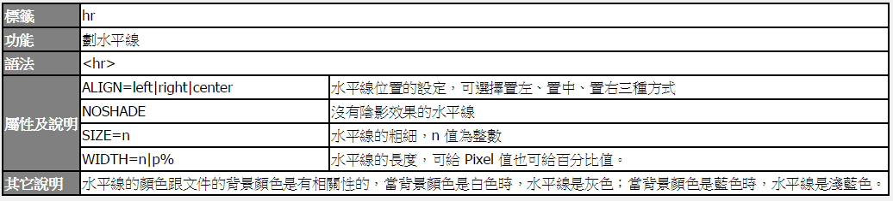

Title: 換行指令
Date: 2017-06-07 11:56
Category: HTML
Tags: notes, HTML
Slug: Paragraphs
Author: 40423222

以下為HTML的Paragraphs說明

<!-- PELICAN_END_SUMMARY -->

## <B>切換到下一行:</B>

<pre>
利用&lt;br&gt;來切換 到下一行
</pre>

### 指令
<pre>
<xmp>
利用＆lt;br＆gt;來切換 到下一行
</xmp>
</pre>

注意: 為了不讓「小於」及「大於」符號被瀏覽器解譯，因此要寫成「＆lt;」和「＆gt;」

## <B>新的段落:</B>
<pre>
123
新的一個段落，會和前面的文字隔開一列
123
</pre>

### 指令
<pre>
<xmp>
123
新的一個段落，會和前面的文字隔開一列
123
</xmp>
</pre>

## <b>新增切線分開:</b>
<pre>
123
換行並加上水平線
 
靠右視窗寬度50%無陰影粗10:

</pre>

### 指令
<pre>
<xmp>
123
換行並加上水平線
 
靠右視窗寬度50%無陰影粗10:

</xmp>
</pre>

注意: 不知為何,無法控制線(hr):陰影跟粗細

## <b>集中:</b>
<pre>
123<blockquote>文字會自成一個段落，並以縮排的方式表現出來，而且與上下文章保留一段空白</blockquote>123
</pre>

### 指令
<pre>
<xmp>
123<blockquote>文字會自成一個段落，並以縮排的方式表現出來，而且與上下文章保留一段空白</blockquote>123
</xmp>
</pre>