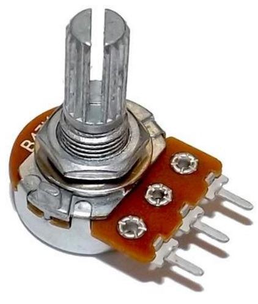

Title: Potentiometer
Date: 2017-06-11 11:38
Category: Arduino
Tags: notes, Arduino
Slug: Potentiometer
Author: 40423222

以下為Potentiometer的解說

<!-- PELICAN_END_SUMMARY -->

### Potentiometer零件: 
 

### Potentiometer裝配方式: 
 

### 運作原理: 
可變電阻有三個腳位,左右兩腳如上圖是連接火線跟地線(也可左接LOW右接HIGH),而假如你選擇了500Ω,那左右兩腳的電阻就是500Ω,重點是中間的腳位,轉動旋鈕可改變中間腳位的電阻,也就可以改變輸出的電流.
 
注意: 當你選擇了500Ω的可變電阻,那中間腳位的最大電阻也就是500Ω

### 參考網站: 
1.Potentiometer零件圖:
<a href="https://store.fut-electronics.com/collections/potentiometers">https://store.fut-electronics.com/collections/potentiometers</a>
 
參考對象:
 