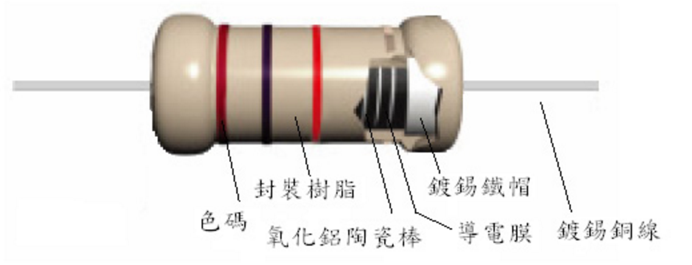
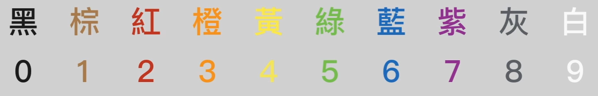
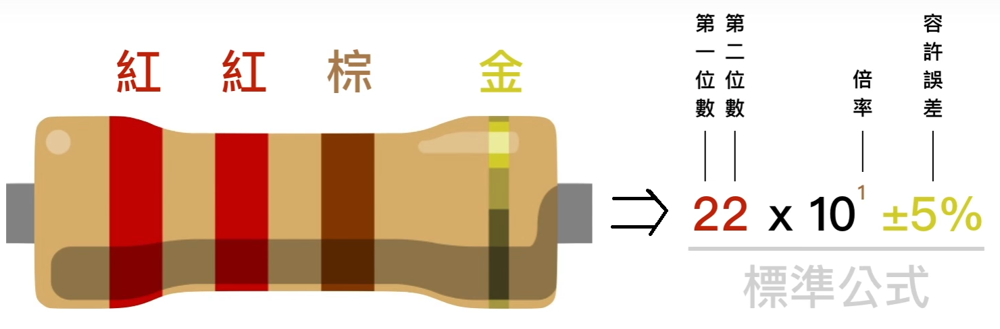
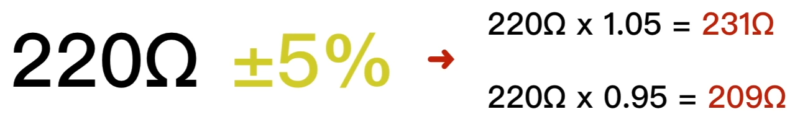
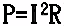
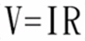
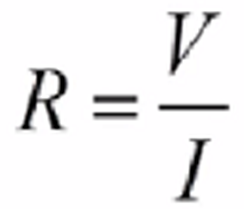
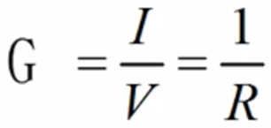
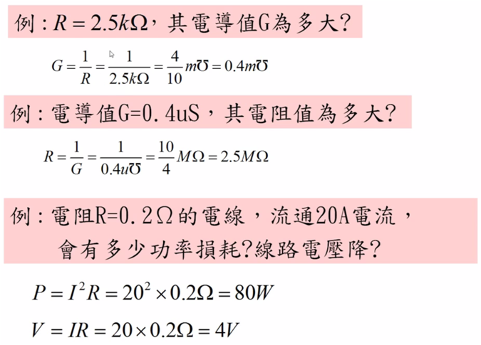

Title: Resistance
Date: 2017-05-06 14:52
Category: Arduino
Tags: notes, Arduino
Slug: Arduino-Resistance
Author: 40423222

以下為Resistance的解說

<!-- PELICAN_END_SUMMARY -->

### 電阻零件: 
1.膜式電阻結構圖 
 

2.線繞電阻結構圖 
 

### 電阻的值: 
1.色環 
  

2.顏色 
  

範例: 
 
 

### 電阻相關的公式: 
P = 功率 , I = 電流 , V = 電壓 , R = 電阻 , G = 電導 

1.功率消耗 
 

2.電壓降 
 
也可寫成歐姆定律 
 

3.電導(Conductance) 
 

範例: 
 

### 參考網站: 
1.電阻零件:
<a href="http://www.shimeng.org/zh/know/21.html">http://www.shimeng.org/zh/know/21.html</a> 
參考對象:
 

2.電阻的值:
<a href="https://www.youtube.com/watch?v=cWEJMusT-hI">https://www.youtube.com/watch?v=cWEJMusT-hI</a> 
參考對象:
 

3.電阻相關的公式:
<a href="https://www.youtube.com/watch?v=lnC6J9AplMc">https://www.youtube.com/watch?v=lnC6J9AplMc</a> 
參考對象:

